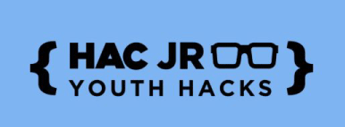

## ManchesterYouthHack

HAC100 Challenge

## The Challenge

Home recycling is a massive problem in today’s society. We’re pushed to recycle but it’s not made easy. How can we use existing technology to help encourage families to recycle more efficiently and effectively? Could this be monetised or incentivised? Let’s help keep our world sustainable!

## Tips

## The Prizes
Cinema Voucher for each member of the winning team \o/

